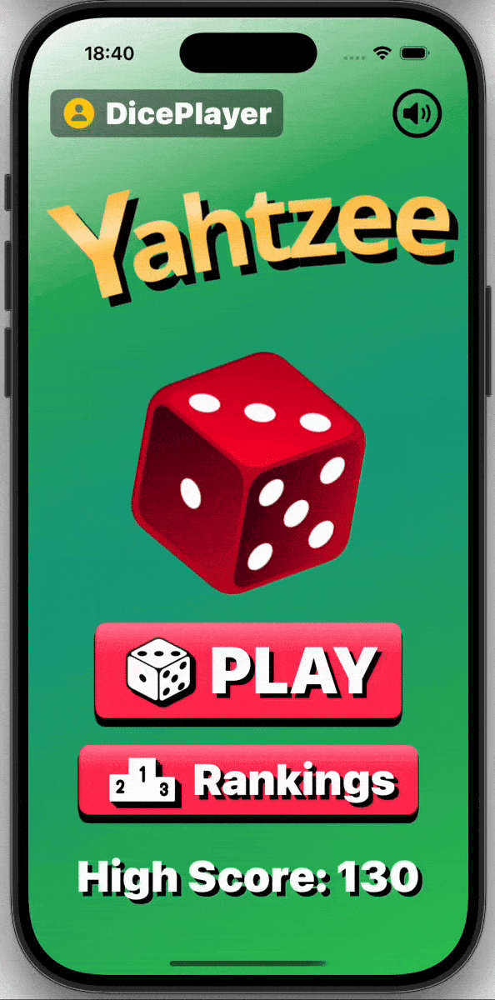
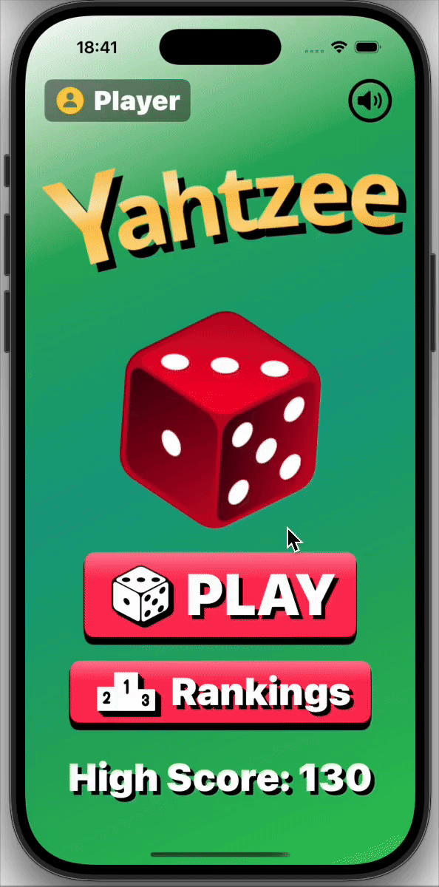

# 🎲 Yahtzee
這是一款使用 **SwiftUI** 開發的 Yahtzee 骰子遊戲。  
除了完整的遊戲規則外，還包含以下特色功能：

## ✨ 功能
- **遊戲核心流程與互動體驗**：擲骰、保留與填分，結合音效與動畫提升使用者體驗  
- **資料管理與雲端同步**：利用 SwiftData、CoreData 及 Firebase 實現進度存檔與排行榜功能  
- SwiftUI + MVVM 架構設計，提升維護性與擴展性  
- 自訂 Modifier 與 Extension，提升元件可重用性  
- 音效管理系統，支援即時開關控制  

## 🎮 操作示意圖

  
  
  
  

