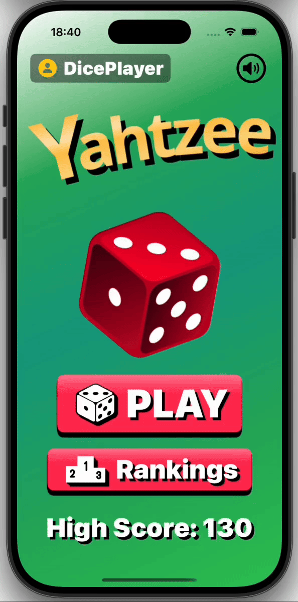

# Yahtzee 🎲

這是一款使用 **SwiftUI** 開發的 Yahtzee 骰子遊戲。  
除了完整的遊戲規則外，還包含以下特色功能：

## ✨ 功能
- 🎮 **基本遊戲流程**：擲骰子、選擇保留、填入分數  
- 💾 **遊戲進度保存**：結合 SwiftData 與 CoreData 支援即時存檔與讀取
- 🔊 **音效系統處理**：擲骰音效，可隨時開關  
- 🏆 **高分排行榜**：透過 Firebase 跟 SwiftData 儲存歷史高分  
- 🖼️ **動畫與自訂 UI**：骰子動態效果、客製化介面  

- SwiftUI + MVVM 架構  
- Firebase 整合（雲端紀錄）  
- 自訂 Modifier 與 Extension 提升元件可重用性  
- 音效管理與動畫效果

## 操作示意圖

  
  

  
  

